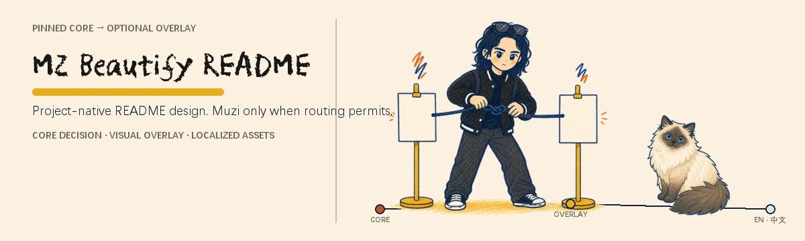
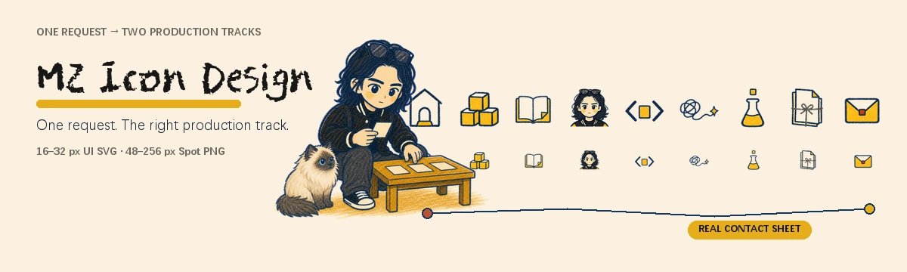
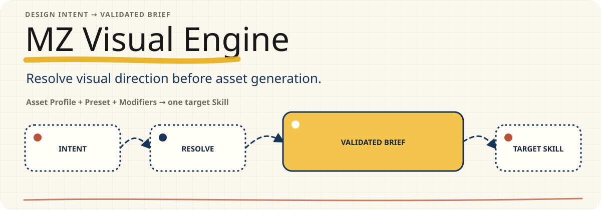

<p align="right"><a href="README.zh-CN.md">简体中文</a></p>

<p align="center">
  <picture>
    <source media="(max-width: 480px)" srcset="docs/readme/assets/hero.mobile.webp">
    
  </picture>
</p>

A self-contained Codex Skill for redesigning GitHub README homepages. It preserves project-native design decisions from a pinned upstream core, then applies Muzi only when repository ownership or explicit user intent enables the overlay.

`v0.2.0` · upstream core [`oil-oil/beautify-github-readme@55bdb1c`](https://github.com/oil-oil/beautify-github-readme/commit/55bdb1c05414cd7a0cf911d02e55ece79777206e) · English and Simplified Chinese assets

## See it work

### [MZ Icon Design](https://github.com/MuziGeek/mz-icon-design) — Artifact wall + Hybrid

The upstream core chose an artifact wall because several real icon outputs explain the product. The Muzi overlay adds the inspector, cat, paper, color, and hand-drawn treatment; the real contact sheet remains the primary proof.

<p align="center">
  <picture>
    <source media="(max-width: 480px)" srcset="docs/readme/samples/mz-icon-design/hero.mobile.webp">
    
  </picture>
</p>

### [MZ Visual Engine](https://github.com/MuziGeek/mz-visual-engine) — Integrated + SVG

The upstream core chose an integrated SVG flow. Muzi changes the visual tokens, title treatment, and hand-drawn paths, but it does not add a character, cat, or raster layer. The composition and implementation stay project-native.

<p align="center">
  <picture>
    <source media="(max-width: 480px)" srcset="docs/readme/samples/mz-visual-engine/hero.mobile.svg">
    
  </picture>
</p>

These are local `READY_FOR_REVIEW` display snapshots. Their exact source-manifest and asset hashes are recorded in [sample provenance](docs/readme/samples/provenance.json).

## How it decides

The Skill always resolves the design system before the brand layer:

1. Inspect the repository and lock its audience, concrete value, real proof, and first successful action.
2. Let the pinned upstream core choose the content order, five-part theme, composition, and SVG／Hybrid／Raster route.
3. Resolve `overlay=muzi|none` from explicit intent and repository ownership.
4. Apply Muzi tokens and identity without changing the locked core decision.
5. Generate localized assets, preview them on GitHub-sized canvases, validate, and stop at `READY_FOR_REVIEW`.

| Upstream design core owns | Muzi Visual Overlay may change |
| --- | --- |
| Claims, information order, real proof | Warm paper, ink, mustard, navy, restrained rust |
| Theme reasoning and composition | Hand-drawn line, crayon texture, annotations |
| SVG／Hybrid／Raster implementation | Suitable PFanHuTuTi display treatment |
| Responsive, accessibility, GitHub safety | Muzi or cat only when they have a communication job |
| Preview, validation, and publishing gates | Local emphasis without displacing proof |

Muzi never forces a split layout, character, cat, fixed Hero height, or different technical route.

## Install and use

Standalone Skills can be installed from another GitHub repository with `$skill-installer`. See the [official OpenAI Build skills documentation](https://learn.chatgpt.com/docs/build-skills).

```text
Use $skill-installer to install:
https://github.com/MuziGeek/mz-beautify-readme/tree/main/mz-beautify-readme
```

Then invoke the installed Skill in the repository whose README you want to improve:

```text
Use $mz-beautify-readme to redesign this repository README.
Preserve the upstream design decisions, apply Muzi only if routing permits,
generate English and Simplified Chinese assets, show local previews, and do not publish.
```

Useful scopes:

```text
Use $mz-beautify-readme to audit this README without editing files.
```

```text
Use $mz-beautify-readme to refresh the whole README around its strongest real proof.
```

```text
Use $mz-beautify-readme to create only a localized Hero asset set and leave the README unchanged.
```

## Multilingual and review contracts

- `mz.readme-brief/2` separates the immutable upstream `coreDecision` from the optional `overlay` and records locale-to-README routing.
- `mz.readme-asset/2` records the upstream commit, overlay ID, Brief hash, source hashes, locale, viewport, and deterministic output hashes.
- Text-bearing assets are generated separately for every locale; proof and core decisions remain shared.
- A Muzi one-board Hybrid Hero must read as one scene. Visible source rectangles, unrelated cards, and unused full-width empty bands fail review.
- Ordinary execution is offline. GIF remains explicit opt-in, and external publishing always requires separate authorization.

The self-showcase Brief and asset record are available at [docs/readme/source/hero-brief.json](docs/readme/source/hero-brief.json) and [docs/readme/hero-manifest.json](docs/readme/hero-manifest.json).

## Validate and maintain

From the installable `mz-beautify-readme` directory:

```text
python scripts/verify_upstream_snapshot.py
python scripts/test_mz_beautify_readme.py
python scripts/validate_brief.py path/to/hero-brief.json
python scripts/validate_asset_manifest.py path/to/hero-manifest.json
python scripts/audit_readme.py path/to/README.md
python scripts/audit_visual_balance.py path/to/hero.webp
```

The upstream snapshot is byte-locked and never upgraded during normal use. Maintainers may check drift with `sync_upstream.py --check`; applying an upstream update remains an explicit maintenance task.

## License and provenance

Code and documentation are MIT licensed. The pinned upstream snapshot retains its MIT attribution. MZ/Muzi identity references and README showcase artwork use the [MZ Reference Asset License 1.0](ASSET_LICENSE.md); they may be used to operate, evaluate, or review this Skill, but not extracted as standalone art.

See [NOTICE.md](NOTICE.md), [PUBLIC_MANIFEST.json](PUBLIC_MANIFEST.json), and the nested [third-party notices](mz-beautify-readme/THIRD_PARTY_NOTICES.md) for the complete release boundary.
