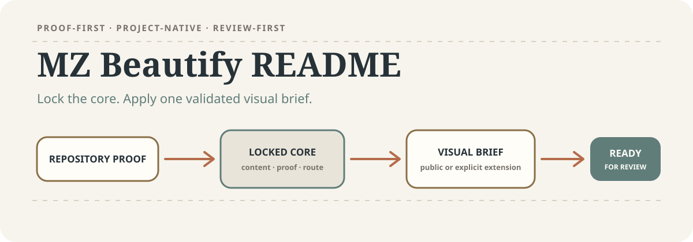
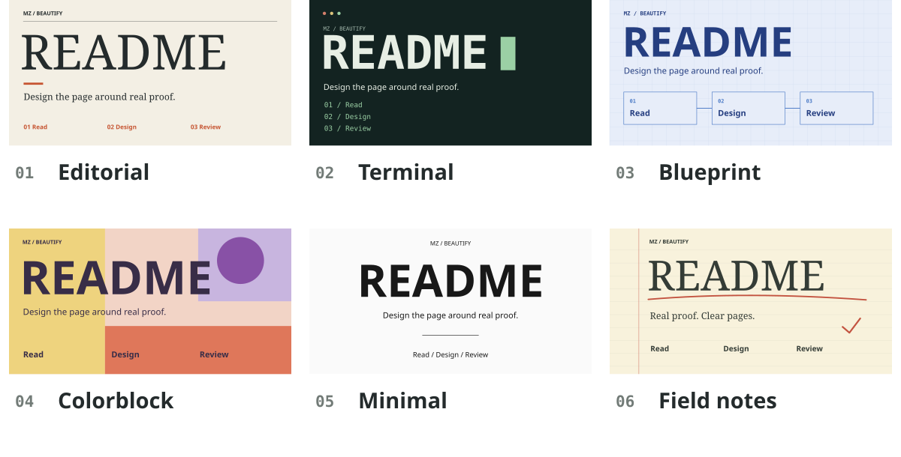

<p align="right"><a href="README.zh-CN.md">简体中文</a></p>

<picture>
  <source media="(max-width: 600px)" srcset="docs/readme/hero.mobile.svg">
  
</picture>

# MZ Beautify README

Turn repository facts into a README people can understand, try, and judge. This Skill redesigns the page, creates editable artwork, and checks the complete result across languages and screen sizes.

[Use the Skill](mz-beautify-readme/SKILL.md) · [Explore the style examples](docs/readme/styles/README.md) · [Review workflow](mz-beautify-readme/references/review-evidence.md)

## Try it on your repository

Install the Skill into a compatible agent environment:

```text
Use $skill-installer to install:
https://github.com/MuziGeek/mz-beautify-readme/tree/main/mz-beautify-readme
```

Then open the target repository and request a concrete result:

```text
Use $mz-beautify-readme.
Redesign this repository's README.
Use project-based editorial design.
Create English and Chinese pages.
Make the artwork work on mobile.
Preview the full pages.
Check the first-use example.
Fix issues before delivery.
```

The first step reads project facts and existing outputs. It does not invent a demo, usage numbers, badges, or a customer story to fill the design.

## One project, six visual directions

These are actual SVG compositions made for this repository, each with English, Chinese, desktop and mobile versions. They demonstrate design directions you can request; they are not six installed Engine presets.

<picture>
  <source media="(max-width: 600px)" srcset="docs/readme/styles.mobile.svg">
  
</picture>

- **Editorial:** Large serif type, paper tones, numbered rhythm. Suits a project with a clear story.
- **Terminal:** Monospace type, dark surface, command-like sequence. Suits developer tools and CLIs.
- **Blueprint:** Grid, connected stages, engineering blue. Suits pipelines and architecture.
- **Colorblock:** Bold geometry, contrasting fields, oversized type. Suits creative tools and visual products.
- **Minimal:** Monochrome, centered type, restrained detail. Suits libraries and focused utilities.
- **Field notes:** Ruled paper, margin marks, red annotations. Suits learning and research projects.

[See full-size examples and copyable prompts →](docs/readme/styles/README.md)

## What you receive

- **A readable homepage:** clear value, useful proof, a first action, and supporting details in the right order.
- **Editable visual assets:** a project-specific Hero and supporting graphics, with separate layouts and copy where languages or screen sizes need them.
- **A result you can inspect:** complete-page previews, before/after findings, source files, and a reviewable diff.

SVG suits crisp type, diagrams and editable compositions; all examples above use it. Hybrid combines raster material with SVG layout. Raster suits image-led scenes. Animated GIF requires an explicit request. These are production options, not promises that every project needs every format.

## How the result is checked

The workflow verifies claims against source, exercises the first-use example where feasible, and inspects the entire README at 900px and 360px in light and dark surroundings. An image-free pass checks that essential instructions remain available as text. Defects are repaired and affected previews are regenerated.

The preview is a local GitHub-like approximation. It does not establish live GitHub rendering or remote service availability. File-backed review records distinguish a result ready for your review from one you have accepted; a passing check cannot decide whether you like the design.

## For maintainers

From the repository root, verify the pinned core and regenerate this page's illustrations:

```text
python mz-beautify-readme/scripts/verify_upstream_snapshot.py
python tools/build_readme_assets.py
```

- [Design and copy decisions](mz-beautify-readme/references/outcome-design.md)
- [Preview setup and evidence commands](mz-beautify-readme/references/review-evidence.md)
- [Research integrated into the upgraded Skill](mz-beautify-readme/references/research-integration.md)
- [Brief schema](mz-beautify-readme/references/brief.schema.json) · [Asset schema](mz-beautify-readme/references/asset-manifest.schema.json)

The public route is identity-neutral and uses `mz-readme-project-native-v1`. A brand-specific extension must be supplied explicitly. The design core is pinned from [oil-oil/beautify-github-readme](https://github.com/oil-oil/beautify-github-readme); its attribution is retained in [NOTICE.md](NOTICE.md). Code, documentation and repository-created examples are covered by the [MIT license](LICENSE).
