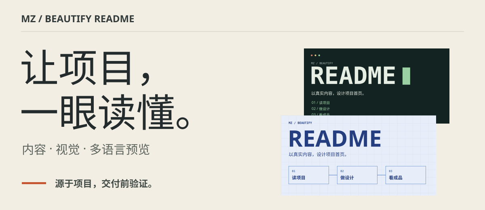
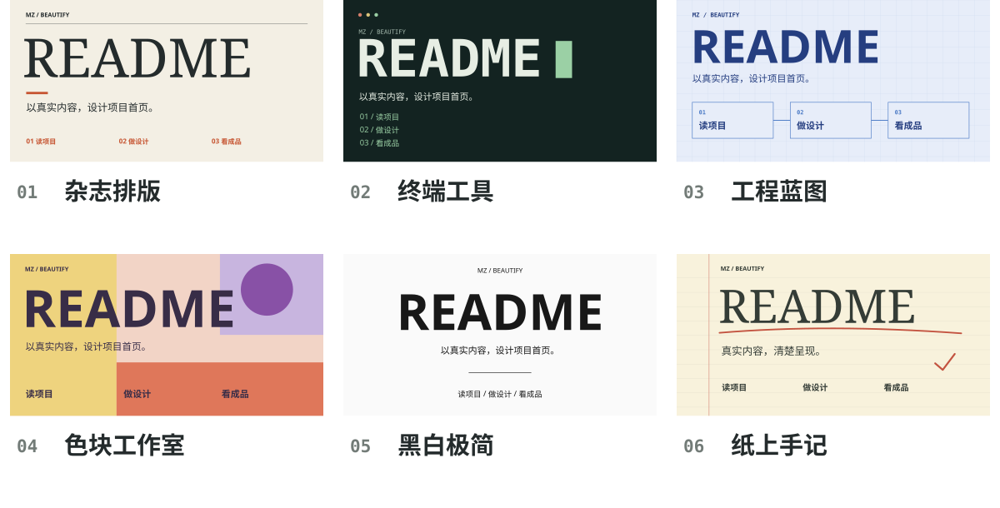

<p align="right"><a href="README.md">English</a></p>

<picture>
  <source media="(max-width: 600px)" srcset="docs/readme/hero.zh-CN.mobile.svg">
  
</picture>

# MZ Beautify README

把仓库里的真实内容，变成读者看得懂、用得上、能判断好坏的 README。这个 Skill 会整理整页文案、制作可编辑配图，并检查不同语言与屏幕尺寸下的实际效果。

[查看 Skill](mz-beautify-readme/SKILL.md) · [浏览风格示例](docs/readme/styles/README.zh-CN.md) · [了解验收流程](mz-beautify-readme/references/review-evidence.md)

## 用在你的仓库里

先在支持 Skill 的代理环境中安装：

```text
使用 $skill-installer 安装：
https://github.com/MuziGeek/mz-beautify-readme/tree/main/mz-beautify-readme
```

再打开目标仓库，给出具体任务：

```text
使用 $mz-beautify-readme 美化当前仓
库的 README。
采用贴合项目内容的杂志排版方向。
制作中英文页面和适合手机阅读的配图。
展示完整页面预览，验证首次使用示例，
修复发现的问题后再交付。
```

它会先读取项目事实和已有输出，不用虚构的演示、使用人数、徽章或客户故事填满画面。

## 同一个项目，六种视觉方向

以下是为本仓库实际制作的 SVG 构图示例，每种都有中英文、桌面和手机版本。它们展示可以要求的设计方向，并非六个已经安装的 Engine 预设。

<picture>
  <source media="(max-width: 600px)" srcset="docs/readme/styles.zh-CN.mobile.svg">
  
</picture>

- **杂志排版：** 大标题、纸色背景、编号节奏；有明确故事线的项目。
- **终端工具：** 等宽字体、深色底、命令式阅读顺序；开发者工具、命令行项目。
- **工程蓝图：** 网格、连接步骤、工程蓝；流水线、架构与基础设施。
- **色块工作室：** 大块几何、撞色分区、醒目字体；创意工具、视觉产品。
- **黑白极简：** 单色、居中标题、少量细节；功能聚焦的类库与工具。
- **纸上手记：** 横线纸、页边线、红色批注；学习、研究与知识项目。

[查看完整大图与可复制的风格提示词 →](docs/readme/styles/README.zh-CN.md)

## 你会拿到什么

- **能读懂的首页：** 清楚的项目价值、有用的证据、第一步操作，以及按阅读顺序组织的说明。
- **可编辑的视觉素材：** 贴合项目的 Hero 和辅助图；语言或屏幕尺寸有需要时，单独制作布局与文案。
- **可以检查的成品：** 完整页面预览、修改前后对比、源文件和可审阅的差异。

SVG 适合清晰的文字、图解和可编辑构图，本页示例全部采用它。Hybrid 将位图素材与 SVG 排版结合；Raster 适合以图像为主的场景。GIF 动图需要明确提出。这些是制作方式，实际项目按需要选择。

## 如何检查成品

流程会对照源码核实事实，在环境允许时执行首次使用示例，并检查 900px、360px 宽度下的整页，以及明暗背景中的表现。关闭图片后再看一遍，确认关键说明仍然是可读文字。发现问题后修复，并重新生成受影响的预览。

预览是本地对 GitHub 页面样式的近似，不代表已验证线上 GitHub 或远程服务。评审记录绑定当前文件与截图，区分“可以交给你评审”和“你已经满意”；检查通过不能代替你的审美判断。

## 维护与深入了解

在仓库根目录执行，验证固定版本的核心并重新生成本页配图：

```text
python mz-beautify-readme/scripts/verify_upstream_snapshot.py
python tools/build_readme_assets.py
```

- [设计与文案决策](mz-beautify-readme/references/outcome-design.md)
- [预览环境与验证命令](mz-beautify-readme/references/review-evidence.md)
- [升级时融合的研究结论](mz-beautify-readme/references/research-integration.md)
- [Brief 格式](mz-beautify-readme/references/brief.schema.json) · [素材记录格式](mz-beautify-readme/references/asset-manifest.schema.json)

公开路线不绑定个人身份，使用 `mz-readme-project-native-v1`；品牌扩展需要显式提供。设计核心固定引用 [oil-oil/beautify-github-readme](https://github.com/oil-oil/beautify-github-readme)，保留 [NOTICE.md](NOTICE.md) 中的来源署名。代码、文档和本仓库制作的示例采用 [MIT 许可](LICENSE)。
