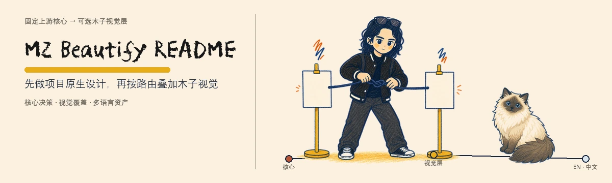
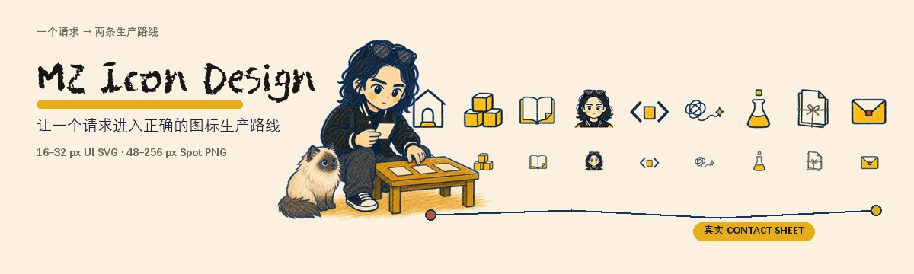
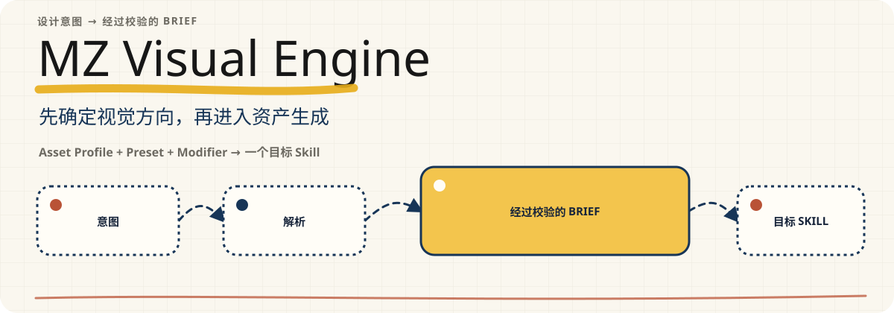

<p align="right"><a href="README.md">English</a></p>

<p align="center">
  <picture>
    <source media="(max-width: 480px)" srcset="docs/readme/assets/hero.zh-CN.mobile.webp">
    
  </picture>
</p>

一个用于重新设计 GitHub README 首页的自包含 Codex Skill。它先保留固定上游核心做出的项目原生设计判断，再根据仓库归属或用户显式要求决定是否叠加木子视觉。

`v0.2.0` · 上游核心 [`oil-oil/beautify-github-readme@55bdb1c`](https://github.com/oil-oil/beautify-github-readme/commit/55bdb1c05414cd7a0cf911d02e55ece79777206e) · 支持英文与简体中文资产

## 实际效果

### [MZ Icon Design](https://github.com/MuziGeek/mz-icon-design) — Artifact wall + Hybrid

上游核心选择 Artifact wall，因为多个真实图标输出最能说明项目能力。木子视觉层加入检查者、小猫、纸张、配色和手绘质感；真实 contact sheet 仍然是主要证明。

<p align="center">
  <picture>
    <source media="(max-width: 480px)" srcset="docs/readme/samples/mz-icon-design/hero.zh-CN.mobile.webp">
    
  </picture>
</p>

### [MZ Visual Engine](https://github.com/MuziGeek/mz-visual-engine) — Integrated + SVG

上游核心选择 Integrated SVG 流程。木子视觉层只改变视觉 Token、标题处理和手绘路径，不加入人物、小猫或栅格层；构图与技术路线继续服从项目本身。

<p align="center">
  <picture>
    <source media="(max-width: 480px)" srcset="docs/readme/samples/mz-visual-engine/hero.zh-CN.mobile.svg">
    
  </picture>
</p>

以上是当前本地 `READY_FOR_REVIEW` 展示快照。源 Manifest 与每个资产的精确哈希记录在[样例来源文件](docs/readme/samples/provenance.json)中。

## 它如何做出判断

Skill 始终先确定设计系统，再处理品牌表现：

1. 检查仓库事实，锁定受众、具体价值、真实证明和第一个成功动作。
2. 由固定上游核心选择内容顺序、五项主题规范、构图以及 SVG／Hybrid／Raster 路线。
3. 根据显式要求和仓库归属解析 `overlay=muzi|none`。
4. 在不改变核心决定的前提下应用木子 Token 与品牌形象。
5. 生成本地化资产，在 GitHub 尺寸下预览、校验，并停在 `READY_FOR_REVIEW`。

| 上游设计核心负责 | Muzi Visual Overlay 可以改变 |
| --- | --- |
| 项目主张、信息顺序、真实证明 | 暖纸、墨色、芥末黄、海军蓝和少量锈红 |
| 主题判断与构图 | 手绘线条、蜡笔纹理和批注 |
| SVG／Hybrid／Raster 技术路线 | 适合时使用 PF频凡胡涂体展示标题 |
| 响应式、可访问性与 GitHub 安全 | 只有承担沟通职责时才加入木子或小猫 |
| 预览、验证与发布门禁 | 不挤占真实证明的局部强调 |

木子视觉层不会强制左右分栏、人物、小猫、固定 Hero 高度或不同的技术路线。

## 安装与使用

可以用 `$skill-installer` 从其他 GitHub 仓库安装独立 Skill。参见 [OpenAI 官方 Build skills 文档](https://learn.chatgpt.com/docs/build-skills)。

```text
使用 $skill-installer 安装：
https://github.com/MuziGeek/mz-beautify-readme/tree/main/mz-beautify-readme
```

安装后，在需要优化 README 的仓库中调用：

```text
使用 $mz-beautify-readme 重新设计当前仓库 README。
保留上游设计判断，只在路由允许时应用木子视觉，
生成英文与简体中文资产，展示本地预览，不要发布。
```

常用范围：

```text
使用 $mz-beautify-readme 只读审查当前 README，不修改文件。
```

```text
使用 $mz-beautify-readme 围绕最有说服力的真实证明刷新整个 README。
```

```text
使用 $mz-beautify-readme 只生成多语言 Hero 资产，不改写 README。
```

## 多语言与评审契约

- `mz.readme-brief/2` 将不可变的上游 `coreDecision` 与可选 `overlay` 分开，并记录语言与 README 的对应关系。
- `mz.readme-asset/2` 记录上游提交、Overlay ID、Brief 哈希、源资产哈希、语言、视口和确定性输出哈希。
- 每种语言分别生成含文字的资产；真实证明与核心设计决定在语言之间保持一致。
- Muzi one-board Hybrid Hero 必须像一张完整场景；可见源图矩形、互不相关的浮卡和无用途的整宽空带都会导致评审失败。
- 普通执行保持离线；GIF 必须显式授权，对外发布始终需要单独授权。

当前仓库的自展示 Brief 与资产记录位于 [docs/readme/source/hero-brief.json](docs/readme/source/hero-brief.json) 和 [docs/readme/hero-manifest.json](docs/readme/hero-manifest.json)。

## 验证与维护

在可安装的 `mz-beautify-readme` 目录中运行：

```text
python scripts/verify_upstream_snapshot.py
python scripts/test_mz_beautify_readme.py
python scripts/validate_brief.py path/to/hero-brief.json
python scripts/validate_asset_manifest.py path/to/hero-manifest.json
python scripts/audit_readme.py path/to/README.md
python scripts/audit_visual_balance.py path/to/hero.webp
```

上游快照逐字节锁定，普通执行不会自动升级。维护者可以用 `sync_upstream.py --check` 检查变化；应用上游更新仍然是独立、显式的维护任务。

## 许可与来源

代码与文档使用 MIT。固定上游快照保留原 MIT 归属。MZ／Muzi 身份参考和 README 展示图片使用 [MZ Reference Asset License 1.0](ASSET_LICENSE.md)：可以用于运行、评估和评审本 Skill，但不能作为独立美术素材提取使用。

完整发布边界参见 [NOTICE.md](NOTICE.md)、[PUBLIC_MANIFEST.json](PUBLIC_MANIFEST.json) 和内层的[第三方声明](mz-beautify-readme/THIRD_PARTY_NOTICES.md)。
