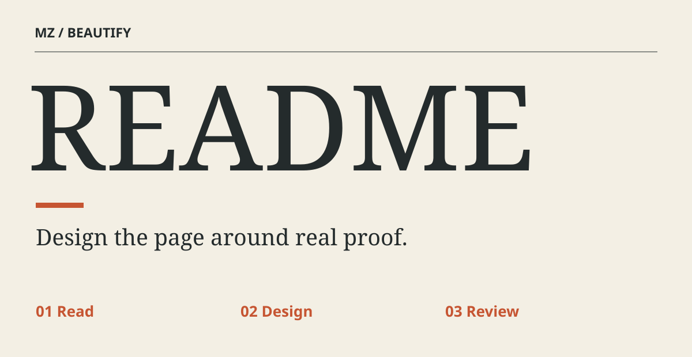
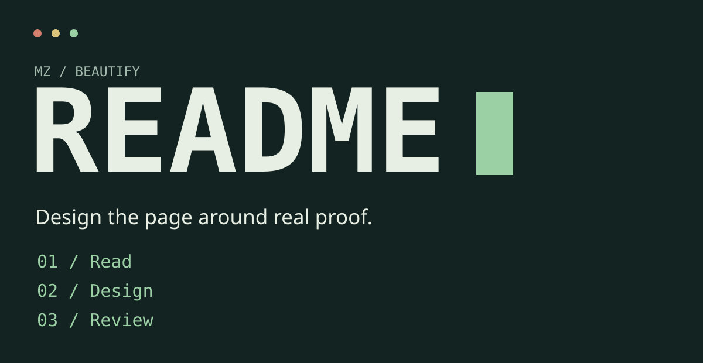
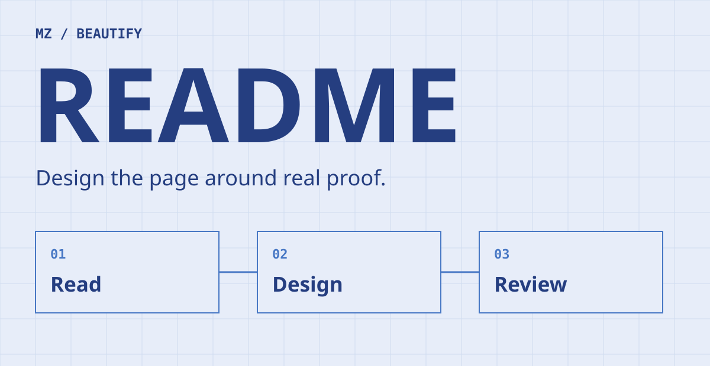
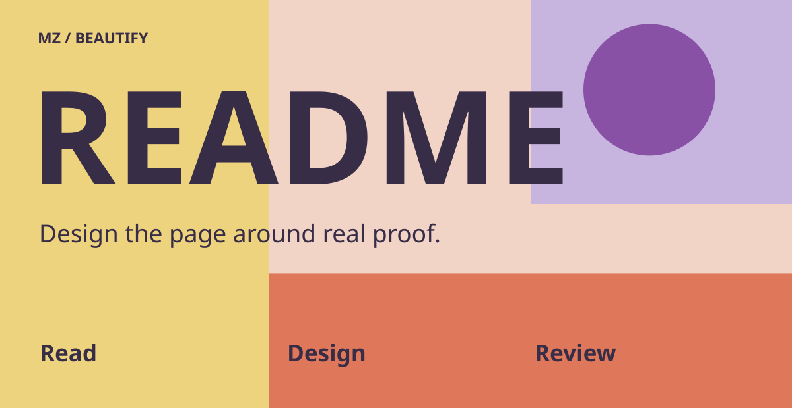
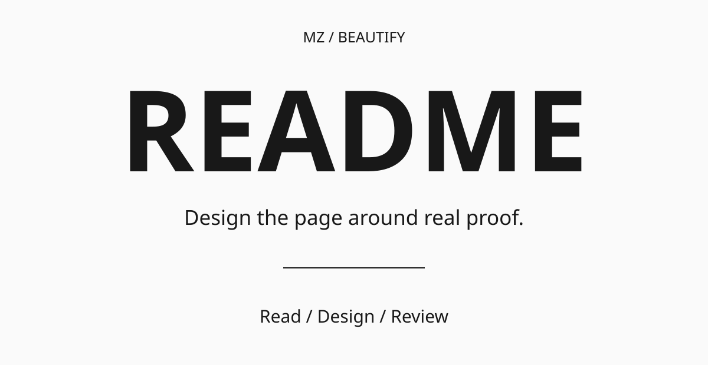
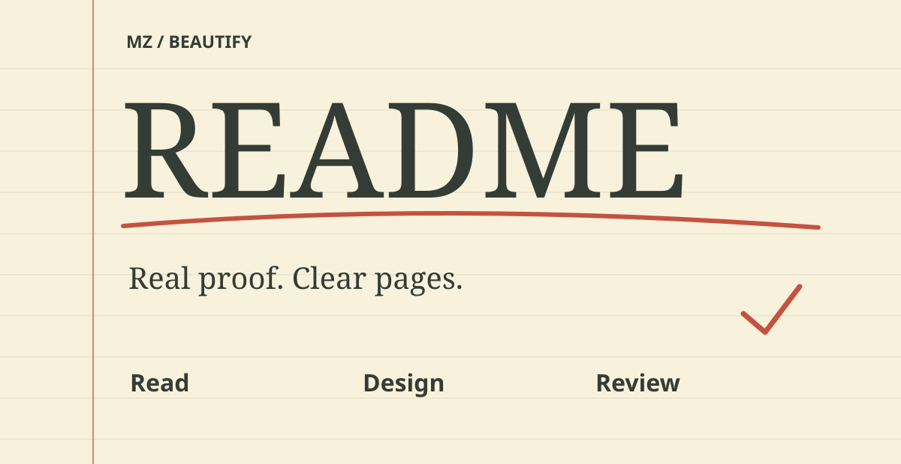

[Back to the project](../../../README.md) · [简体中文](README.zh-CN.md)

# Six directions, and when to use them

These are actual SVG composition specimens for the same Skill. Compare type, layout, rhythm and graphic language. They are neither complete product interfaces nor newly installed Engine presets. The public route remains `mz-readme-project-native-v1`, with composition derived from project facts.

This repository uses the editorial direction to introduce the Skill while showing real specimens of other directions. Terminal suits a code demonstration; Blueprint emphasizes a process. Mobile assets rearrange the content instead of shrinking the desktop canvas.

## 01 · Editorial

Large serif type, warm paper, a thin rule and a numbered footer give the page an editorial rhythm.

<picture>
  <source media="(max-width: 600px)" srcset="editorial.mobile.svg">
  
</picture>

```text
Use $mz-beautify-readme to redesign
this project’s README. Use an
editorial composition: warm paper,
oversized serif type, a single
accent and numbered sections.
Preserve real features and
instructions. Produce English,
Chinese and mobile versions, and
show full-page previews.
```

## 02 · Terminal

A dark canvas, monospace title and vertical sequence borrow the reading habits of command-line tools. This is a design specimen, not a terminal execution log.

<picture>
  <source media="(max-width: 600px)" srcset="terminal.mobile.svg">
  
</picture>

```text
Use $mz-beautify-readme to redesign
this project’s README. Use a
terminal direction: monospace type,
a dark canvas and an actual runnable
example as proof. Preserve real
features and instructions. Produce
English, Chinese and mobile
versions, and show full-page
previews.
```

## 03 · Blueprint

A fine grid and connected stages make relationships part of the composition. Replace the three labels with a source-backed workflow for the target project.

<picture>
  <source media="(max-width: 600px)" srcset="blueprint.mobile.svg">
  
</picture>

```text
Use $mz-beautify-readme to redesign
this project’s README. Use a
blueprint direction: engineering
blue, a measured grid and the
project’s real data flow. Preserve
real features and instructions.
Produce English, Chinese and mobile
versions, and show full-page
previews.
```

## 04 · Colorblock

Large geometric color fields and a circle change the balance of the entire page opening, beyond recoloring a standard banner.

<picture>
  <source media="(max-width: 600px)" srcset="colorblock.mobile.svg">
  
</picture>

```text
Use $mz-beautify-readme to redesign
this project’s README. Use bold
color blocks and oversized type; tie
the geometry to the product’s real
visual output. Preserve real
features and instructions. Produce
English, Chinese and mobile
versions, and show full-page
previews.
```

## 05 · Minimal

Centered typography, ample space and one small rule keep attention on a focused promise. This route needs strong copy and real proof nearby.

<picture>
  <source media="(max-width: 600px)" srcset="minimal.mobile.svg">
  
</picture>

```text
Use $mz-beautify-readme to redesign
this project’s README. Use a
monochrome minimal direction, one
clear promise and a compact,
verifiable usage example. Preserve
real features and instructions.
Produce English, Chinese and mobile
versions, and show full-page
previews.
```

## 06 · Field notes

Ruled paper, a red margin, an underline and a check mark suggest working notes. It uses editable vector marks, not generated paper photography.

<picture>
  <source media="(max-width: 600px)" srcset="fieldnotes.mobile.svg">
  
</picture>

```text
Use $mz-beautify-readme to redesign
this project’s README. Use a
field-notes direction: ruled paper,
restrained annotations and the
project’s actual learning or
research artifacts. Preserve real
features and instructions. Produce
English, Chinese and mobile
versions, and show full-page
previews.
```

## Production and scope

All specimens come from the [editable generator](../../../tools/build_readme_assets.py), with separate localized copy and opaque SVG backgrounds for light and dark pages. Use a direction as a starting point; a target project still needs its own real screenshots, commands or outputs and a fresh review. Hybrid, Raster and explicitly requested GIF are also production options; they are not represented here as generated samples.
