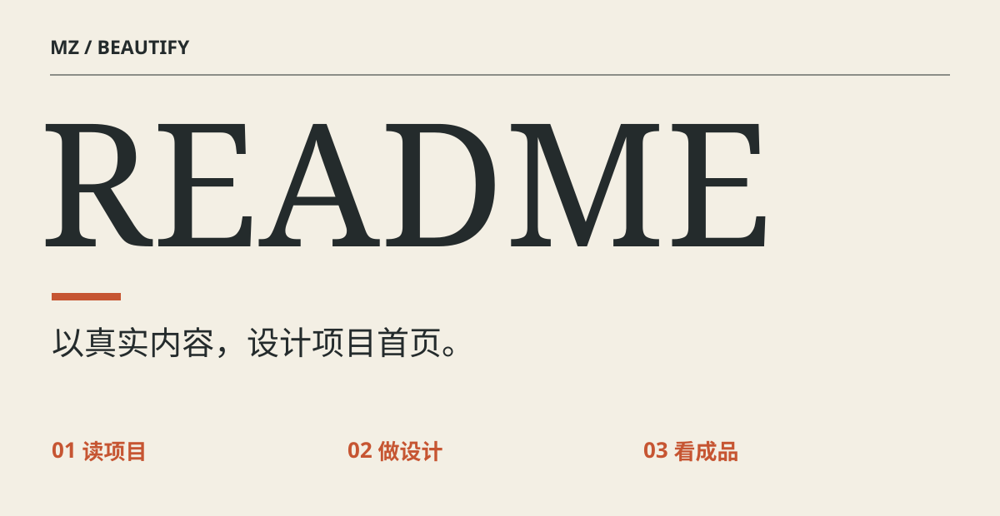
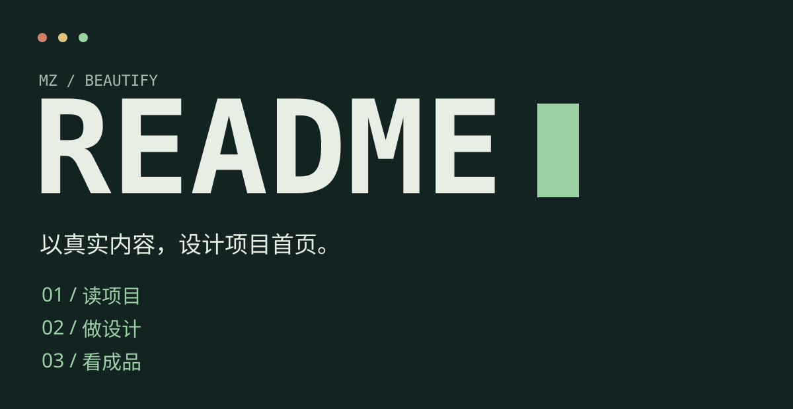
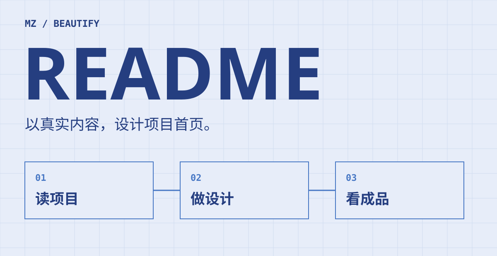
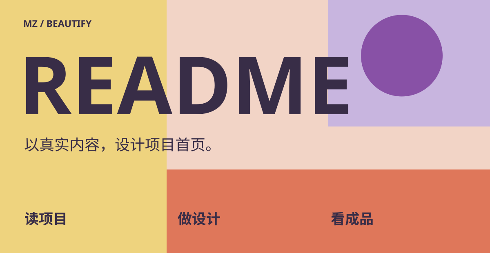
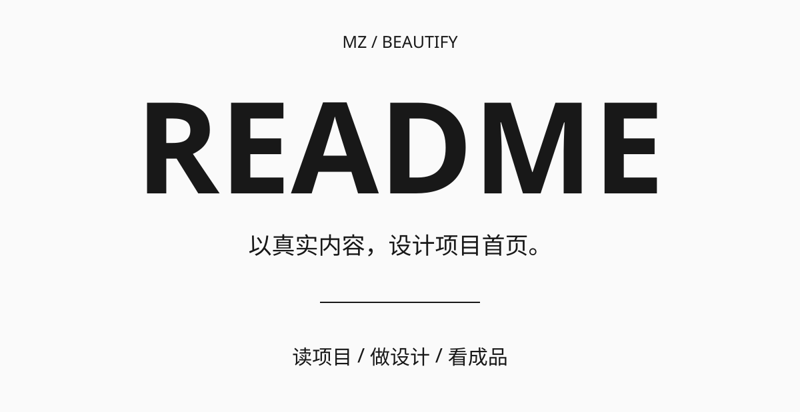
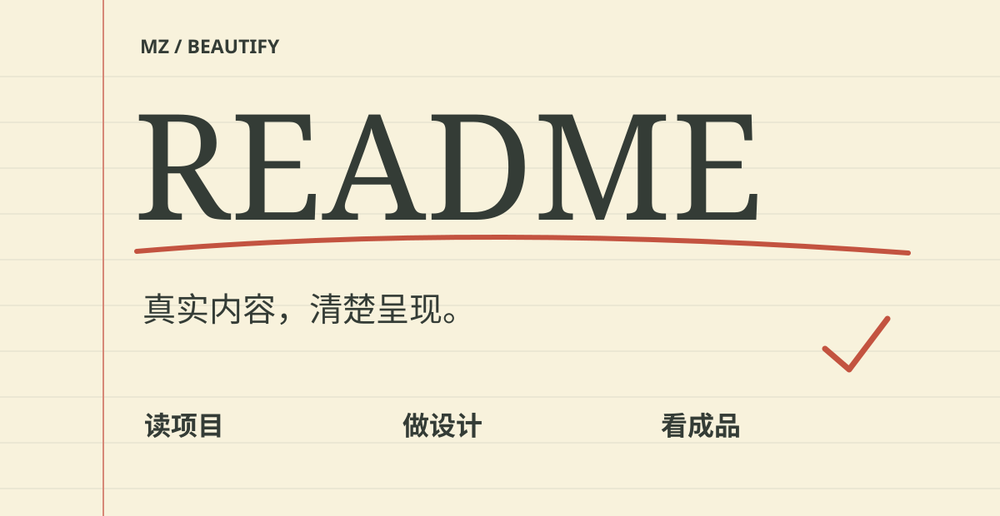

[返回项目首页](../../../README.zh-CN.md) · [English](README.md)

# 六种风格，如何选

这些是同一 Skill 的实际 SVG 构图样张，用于比较字体、布局、节奏与图形语言。它们不是六套完整产品界面，也不是新增的 Engine 预设。公开路线仍是 `mz-readme-project-native-v1`，具体构图从项目事实出发。

本仓库首页选择杂志方向：既能说明 Skill 的用途，也能容纳其他风格的真实样张。终端方向更适合代码演示；蓝图方向更适合强调处理流程。手机版本重新安排了标题与内容，而不是把桌面图等比例缩小。

## 01 · 杂志排版

大号衬线标题、暖纸色、细分隔线与编号页脚，形成杂志的阅读节奏。

<picture>
  <source media="(max-width: 600px)" srcset="editorial.zh-CN.mobile.svg">
  
</picture>

```text
使用 $mz-beautify-readme 美化当前项
目的 README。
采用杂志排版：暖纸色、大号衬线标题、
一个强调色和编号章节。
保留真实功能与使用说明，制作中英文和
手机版本，展示完整页面预览。
```

## 02 · 终端工具

深色画布、等宽标题与纵向步骤，借用命令行工具的阅读习惯。这是设计示例，不是实际终端运行日志。

<picture>
  <source media="(max-width: 600px)" srcset="terminal.zh-CN.mobile.svg">
  
</picture>

```text
使用 $mz-beautify-readme 美化当前项
目的 README。
采用终端方向：等宽字体、深色画布，用
真实可运行的示例作为证据。
保留真实功能与使用说明，制作中英文和
手机版本，展示完整页面预览。
```

## 03 · 工程蓝图

细网格与相连的阶段，让关系本身成为构图。用到其他项目时，应替换成经过源码核实的流程。

<picture>
  <source media="(max-width: 600px)" srcset="blueprint.zh-CN.mobile.svg">
  
</picture>

```text
使用 $mz-beautify-readme 美化当前项
目的 README。
采用工程蓝图方向：工程蓝、细网格，以
及项目真实的数据流。
保留真实功能与使用说明，制作中英文和
手机版本，展示完整页面预览。
```

## 04 · 色块工作室

大面积几何色块与圆形改变首屏重心，强调视觉创作工具的辨识度。

<picture>
  <source media="(max-width: 600px)" srcset="colorblock.zh-CN.mobile.svg">
  
</picture>

```text
使用 $mz-beautify-readme 美化当前项
目的 README。
采用醒目色块和大标题，让几何构图联系
到产品的真实视觉输出。
保留真实功能与使用说明，制作中英文和
手机版本，展示完整页面预览。
```

## 05 · 黑白极简

居中字体、留白和一条短线，集中呈现一个明确价值；需要清楚的文案和就近展示的真实证据。

<picture>
  <source media="(max-width: 600px)" srcset="minimal.zh-CN.mobile.svg">
  
</picture>

```text
使用 $mz-beautify-readme 美化当前项
目的 README。
采用黑白极简方向，只保留一个清晰价值
和简短、可验证的使用示例。
保留真实功能与使用说明，制作中英文和
手机版本，展示完整页面预览。
```

## 06 · 纸上手记

横线纸、红色页边线、下划线与勾选记号，呈现工作手记感。采用可编辑矢量标记，不是生成的纸张照片。

<picture>
  <source media="(max-width: 600px)" srcset="fieldnotes.zh-CN.mobile.svg">
  
</picture>

```text
使用 $mz-beautify-readme 美化当前项
目的 README。
采用纸上手记方向：横线纸、克制的批注
，以及项目真实的学习或研究成果。
保留真实功能与使用说明，制作中英文和
手机版本，展示完整页面预览。
```

## 制作与使用边界

全部样张由 [可编辑生成器](../../../tools/build_readme_assets.py) 制作，中英文分别排版，SVG 自带背景以适配明暗页面。每个方向可作为下一次 README 设计的起点，实际交付仍需补入目标项目的真实截图、命令或输出，并重新验证。Hybrid、Raster 和显式选择的 GIF 也可作为制作方式；本页没有把它们伪装成已经生成的示例。
